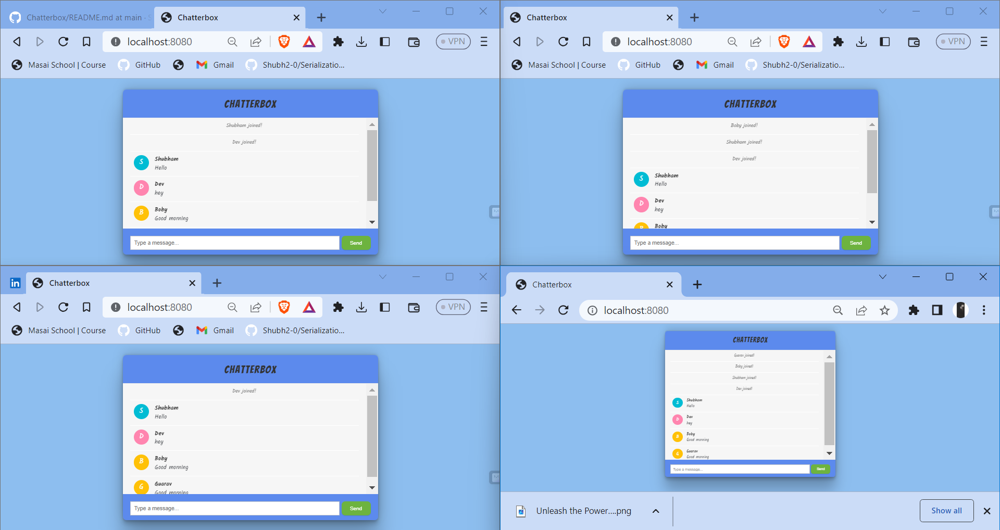

 <h1 align="center">Chatterbox</h1> 

 <h2 align="center">The Ultimate Real-Time Chat Experience! 🌟</h2> 
Chatterbox is a cutting-edge, feature-rich real-time chat application built on the powerful combination of Spring Boot and WebSockets. It enables seamless and interactive communication between users in real-time, fostering vibrant conversations and facilitating efficient information sharing. 💬🚀
 
With Chatterbox, users can engage in lively discussions, exchange valuable insights, collaborate on projects, and build strong communities. The application's intuitive interface provides a delightful user experience, ensuring that individuals of all technical backgrounds can effortlessly navigate and actively participate in the captivating chat environment. 💡💻

## Key Features

✨ Real-Time Messaging: Chatterbox leverages the lightning-fast WebSockets technology, allowing users to exchange messages instantly and effortlessly. Say goodbye to page refreshing and experience seamless conversations in real time!

✨ User Presence: Stay connected with Chatterbox's user presence feature. Easily identify who is online and available for communication, fostering a sense of community and making it easy to initiate engaging discussions.

✨ Join and Leave Notifications: Chatterbox keeps you informed about the chat activity. Receive notifications when users join or leave the chat, ensuring you never miss out on important updates.

✨ WebSocket Integration: Chatterbox harnesses the power of WebSockets to establish a bidirectional communication channel between the server and clients. Enjoy low latency, efficient, and reliable real-time communication.

## Group Chat 👥💬

Chatterbox offers a seamless group chat experience, allowing multiple users to collaborate and engage in conversations simultaneously. Whether you're working on a team project, organizing an event, or simply chatting with friends, Chatterbox's group chat feature ensures everyone stays connected and can actively participate in the discussion.

With Chatterbox's group chat, you can foster collaboration, enhance communication, and make your conversations more engaging than ever!

## Demo 🎥

Check out the demo of Chatterbox in action:

## Javadoc 📃

For more detailed explanations of the classes, methods, and their functionalities, please refer to the [JavaDoc website](https://aquamarine-sprite-f2ebae.netlify.app/) of this Chatterbox project. The JavaDoc documentation provides a comprehensive reference and understanding of the implementation details, making it easier to navigate and comprehend the methods and their usage within the application.

## Tools Used 🛠️

<table align="center">
  <tr>
    <td align="center" width="170">
      
       Java 
    </td>
    <td align="center" width="170">
      
       Spring Boot
    </td>
    <td align="center" width="170">
      
       Spring Websocket
    </td>
    <td align="center" width="170">
      
       Maven
    </td>    
  </tr>
  <tr>
      <td align="center" width="170">
      
       Lombok
    </td>
    <td align="center" width="170">
      
       HTML
    </td>
    <td align="center" width="170">
      
       CSS
    </td>
    <td align="center" width="170">
      
       JavaScript
    </td>
  </tr>
    <tr>
          <td align="center" width="170">
      
       Eclipse
    </td>
     <td align="center" width="170">
      
       VS Code
    </td>
        <td align="center" width="170">
      
       GitHub
    </td> 
          <td align="center" width="170">
      
       Netlify
    </td>
  </tr>
</table>

## Get Started

Ready to embark on an exciting chat journey? Follow these simple steps to get started with Chatterbox:

1. Clone the Chatterbox repository to your local machine using the command: `git clone https://github.com/Shubh2-0/Chatterbox.git`.

2. Ensure you have Java Development Kit (JDK) and Apache Maven installed on your system.

3. Open the project in your favorite Integrated Development Environment (IDE) for easy customization.

4. Build the project using Maven: `mvn clean install`.

5. Launch the application: `mvn spring-boot:run`.

6. Access Chatterbox in your web browser at `http://localhost:8080`.

## Contribute

We believe in the power of collaboration! You're invited to contribute to the growth and improvement of Chatterbox. Here's how you can get involved 🤗:

1. Clone the Chatterbox repository: `git clone https://github.com/Shubh2-0/Chatterbox.git`.

2. Create a new branch: `git checkout -b my-branch`.

3. Make your awesome changes and commit them: `git commit -m "Description of changes"`.

4. Push your branch to the repository: `git push origin my-branch`.

5. Open a pull request on the GitHub repository and let us review your changes.

## Acknowledgements

Chatterbox was developed as a project for learning Spring Boot and WebSockets. We extend our gratitude to the developers and contributors of the libraries and frameworks used in this project for their remarkable work.

<h2>📬 Contact</h2>

If you want to contact me, you can reach me through below handles.

&nbsp;&nbsp;<a href="https://www.linkedin.com/in/shubham-bhati-787319213/"></img></a>

